# Industrial Reliability Copilot

[](https://github.com/Adityagupta200/Industrial-Reliability-Copilot/actions/workflows/ci.yml)
[](https://github.com/Adityagupta200/Industrial-Reliability-Copilot/actions/workflows/cd.yml)


Production-grade RAG + MLOps platform for industrial maintenance.

Industrial Reliability Copilot combines anomaly/RUL inference, hybrid retrieval over manuals and procedures, LLM orchestration, guardrails, offline Ragas evaluation, online telemetry, and Kubernetes deployment automation. It is built as a recruiter-visible Machine Learning Engineering portfolio project: not just a demo chatbot, but a measured, monitored, deployable reliability assistant.

## Demo

Video demo: pending. The live screenshots, Ragas artifacts, and LangSmith trace
below provide current review evidence; a 3 to 5 minute walkthrough remains the
only Phase 10 acceptance item intentionally deferred.

The recording plan, commands, and screenshot checklist are in
[docs/demo_video.md](docs/demo_video.md). After upload, add the YouTube URL here.

## Key Features

- Hybrid RAG retrieval: Qdrant dense search + BM25 keyword search + Reciprocal Rank Fusion.
- Three production chains: root-cause analysis, remediation guidance, and historical incident search.
- Classical ML service: anomaly detection and remaining useful life context exposed through FastAPI.
- Guardrails: prompt-injection detection, toxicity keyword checks, PII redaction via Presidio, citation checks, safety checks, and groundedness judging.
- LLM provider routing: OpenAI primary with Ollama fallback, plus separate live-serving and offline-evaluation model profiles.
- Evidence-based fast path: high-confidence, well-documented bearing vibration cases use direct lookup over real Markdown procedures, then rules, before invoking an LLM.
- Source-grounded answers: internal `DOC_*` tags are validated before being mapped back to filenames.
- Offline quality gate: Ragas faithfulness, answer relevancy, context precision, and context recall in CI.
- Online telemetry: query logs, feedback, latency, token estimates, guardrail counters, cache events, and Prometheus metrics.
- Cloud deployment: Docker, Terraform, EKS, RDS PostgreSQL, ECR, encrypted S3, Kubernetes probes, HPAs, staging/prod rollout, and rollback.
- Incident readiness: realistic production-style incident narratives in [docs/incidents.md](docs/incidents.md).

## Architecture

See [docs/architecture.md](docs/architecture.md) for the full architecture, data flow, deployment model, trade-offs, scalability, and security notes.

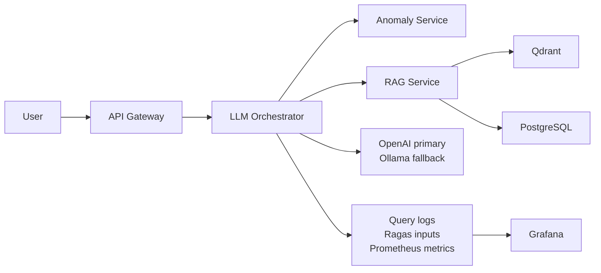

## Current Evidence

Quality scores are from the committed `ragas_results.json` artifact.

| Area | Metric | Current value | Gate or target | Evidence |
| --- | --- | ---: | ---: | --- |
| RAG quality | Faithfulness | 1.000 | >= 0.85 | `ragas_results.json` |
| RAG quality | Answer relevancy | 0.919 | >= 0.85 | `ragas_results.json` |
| Retrieval | Context precision | 1.000 | >= 0.80 | `ragas_results.json` |
| Retrieval | Context recall | 1.000 | >= 0.80 | `ragas_results.json` |
| Safety | Adversarial pass rate | 1.000 | 1.000 | `data/evaluation_results/evaluation_report.json` |
| Contracts | Response contract pass rate | 1.000 | 1.000 | `data/evaluation_results/evaluation_report.json` |
| Evaluation coverage | Golden set | 4 Ragas / 6 total | >= 4 / >= 6 | `ragas_results.json` |
| Security | Bandit findings | 0 | 0 high/medium/low | `bandit-report.json` |
| Tests | Coverage | 53 percent | >= 50 percent CI floor | local `.coverage` report |

Operational targets are documented separately from measured artifacts:

| Target | Status |
| --- | --- |
| End-to-end p95 latency < 2 seconds | Targeted in golden-set `max_latency_ms`; committed load artifact not yet present. |
| 50 QPS | Infrastructure is HPA-ready; add a reproducible load-test report before claiming as achieved. |
| Cost near `$0.12/query` | Cost model target; token counters are implemented, but no committed billing report is present. |

## Tech Stack

| Layer | Technology | Why |
| --- | --- | --- |
| APIs | FastAPI, Pydantic, httpx | Async service boundaries, typed contracts, health probes. |
| ML inference | PyTorch, scikit-learn, joblib | Anomaly and RUL inference with artifact loading and fallback behavior. |
| RAG | Qdrant, BGE/OpenAI embeddings, rank-bm25, RRF | Hybrid retrieval across exact asset terms and semantic maintenance language. |
| LLM orchestration | OpenAI, Ollama, LangSmith tracing | Cloud quality with local fallback, provider-level retry behavior, and traceable guardrail decisions. |
| Guardrails | Presidio, sqlglot, custom safety checks | PII redaction, prompt-injection defense, read-only SQL, grounded answers. |
| Evaluation | Ragas, deterministic contract tests, golden set | Data-driven quality gate for RAG changes. |
| Observability | Prometheus, Grafana, Alertmanager, LangSmith | Latency, quality, feedback, traces, alerts, and incident debugging. |
| Infrastructure | Docker Compose, Kubernetes, Terraform, AWS EKS/RDS/ECR/S3 | Local reproducibility and cloud deployment path. |
| CI/CD | GitHub Actions, Black, Ruff, PyTest, Bandit | Automated test, quality, security, staging, production, and rollback gates. |

## Quick Start

The default `.env.example` uses `gpt-4.1-mini` for live requests and CI-compatible
Ragas judging. Use heavier GPT-5 class models only after measuring that they still
satisfy your live latency SLO and your evaluation stack supports their request
parameters. The Pump P-23 high-vibration demo uses the transparent
`rules+retrieval` fast path when the retrieved procedure directly supports the
diagnosis; set `ROOT_CAUSE_FAST_PATH_ENABLED=false` to force the LLM path for
comparison runs.

PowerShell on Windows:

```powershell
Copy-Item .env.example .env -ErrorAction SilentlyContinue
docker compose up -d postgres qdrant
docker compose run --rm rag-service python -m rag_service.db.init_db
docker compose run --rm rag-service python -m rag_service.db.ingest_incidents
docker compose run --rm rag-service python -m rag_service.ingestion.pipeline
docker compose up -d
```

Check services:

```powershell
Invoke-RestMethod http://127.0.0.1:8000/health/ready
Invoke-RestMethod http://127.0.0.1:8080/health/ready
Invoke-RestMethod http://127.0.0.1:8002/health/ready
Invoke-RestMethod http://127.0.0.1:8001/health/ready
```

Submit a root-cause query:

```powershell
$payload = @{
  chain = "root_cause"
  bypass_cache = $true
  root_cause = @{
    user_query = "Why did pump P-23 trigger anomaly at 03:41?"
    equipment_id = "pump_P-23"
    anomaly_description = "Pump P-23 triggered a high-vibration anomaly at 03:41 with vibration RMS above the alarm threshold and no corresponding pressure drop."
    sensor_data = @{
      vibration_rms = 8.4
      temp_c = 74.2
      pressure_bar = 5.2
      flow_rate_lpm = 176.0
    }
  }
} | ConvertTo-Json -Depth 6

$job = Invoke-RestMethod -Method Post -Uri http://127.0.0.1:8000/query -ContentType "application/json" -Body $payload
Invoke-RestMethod -Method Get -Uri "http://127.0.0.1:8000/query/$($job.job_id)?include_raw_context=true" | ConvertTo-Json -Depth 10
```

Bash equivalent for polling a submitted job with retrieved evidence visible:

```bash
curl -s "http://127.0.0.1:8000/query/${job_id}?include_raw_context=true" | python -m json.tool
```

The default status endpoint omits `raw_context` to keep normal API responses
compact. Use `include_raw_context=true` for evaluation evidence, screenshots, and
demo recording; that response also includes `evidence_summary` with retrieved
`DOC_*` IDs, source files, and context size for quick terminal review. Use
`bypass_cache=true` in the POST payload when capturing LangSmith traces so the
retrieval and guardrail spans are regenerated instead of serving a cache hit.

Populate and verify the Grafana feedback panel from bash:

```bash
bash scripts/phase10_feedback_smoke.sh
```

The smoke command creates a fresh query, waits for completion, posts feedback,
verifies all expected Prometheus scrape targets, reloads and verifies provisioned
Grafana dashboards, and verifies the feedback counter before you capture the dashboard.
On Windows/Git Bash, it auto-detects `.venv`, `myenv`, `py.exe`, `python3`, or
`python`; override with `PYTHON_BIN=./.venv/Scripts/python.exe` if needed.

Generate a LangSmith trace screenshot after configuring `LANGCHAIN_API_KEY`:

```bash
OUTPUT_GUARDRAILS_LLM_JUDGE_MODE=audit ROOT_CAUSE_FAST_PATH_ENABLED=false docker compose up -d --build --force-recreate llm-orchestrator api-gateway
bash scripts/phase10_langsmith_trace_smoke.sh
OUTPUT_GUARDRAILS_LLM_JUDGE_MODE=fallback ROOT_CAUSE_FAST_PATH_ENABLED=true docker compose up -d --build --force-recreate llm-orchestrator api-gateway
```

The trace screenshot should show the LLM-backed path, including input guardrails,
retrieval, the answer `Prompt_Model_Call`, `Output_Guardrails`,
`Deterministic_Groundedness_Check`, and a real `Groundedness_LLM_Judge` audit span
with its nested judge model call. Do not fake this screenshot if LangSmith is not
configured. The script warms the real RAG hybrid and procedure retrieval paths
before submitting the traced query so the screenshot does not confuse cold-start
model/index initialization with steady-state retrieval latency.
For the default Pump P-23 fast path, the trace should instead show
`Root_Cause_Chain`, `Direct_Procedure_Search`,
`Root_Cause_Fast_Path_Decision`, `Fast_Path_Output_Guardrails`, and
`Output_Guardrails`; in default fallback judge mode that path is intentionally
`rules+retrieval` and should record zero actual LLM tokens.

Local URLs:

| Service | URL |
| --- | --- |
| API Gateway | `http://127.0.0.1:8000` |
| LLM Orchestrator direct | `http://127.0.0.1:8080` |
| RAG Service | `http://127.0.0.1:8002` |
| Anomaly Service | `http://127.0.0.1:8001` |
| Prometheus | `http://127.0.0.1:9090` |
| Grafana | `http://127.0.0.1:3000` |
| Qdrant | `http://127.0.0.1:6333/dashboard` |

## Evaluation

Run the offline evaluation against running services:

```powershell
$env:PYTHONPATH = "src"
$env:ORCHESTRATOR_URL = "http://127.0.0.1:8000/query"
.\.venv\Scripts\python.exe src\evaluation\offline\ragas_eval.py
.\.venv\Scripts\python.exe scripts\check_thresholds.py
```

Documentation: [docs/evaluation.md](docs/evaluation.md)

## Deployment

Infrastructure is defined under `infra/terraform` and `infra/kubernetes`.

- Terraform provisions VPC, EKS, RDS PostgreSQL, encrypted S3 buckets, ECR repositories, and EKS access entries.
- CD uses GitHub OIDC to deploy to staging, run smoke checks, deploy production, monitor rollout, and rollback on failure.
- Secret setup and DSN requirements are documented in [docs/deployment_secrets.md](docs/deployment_secrets.md).

## Screenshots

The screenshots below are captured from a live local run and the passing GitHub
Actions quality gate. Numbered screenshots are used where a single screen cannot
show the full evidence clearly without shrinking important text.

### Query Response

<table>
  <tr>
    <td>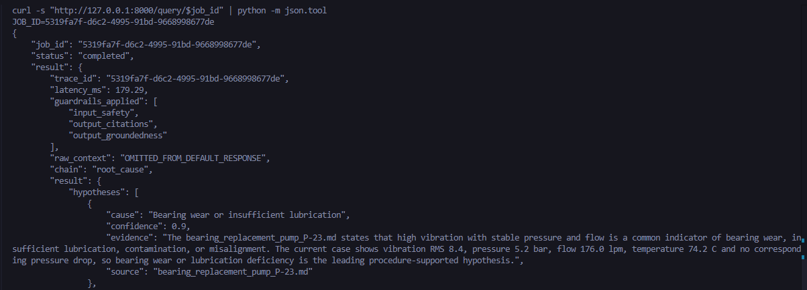</td>
    <td>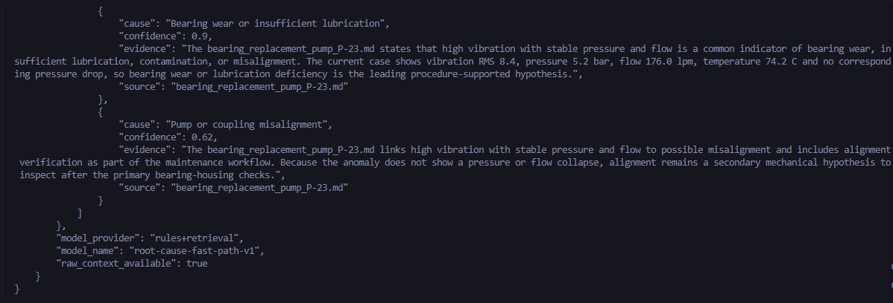</td>
  </tr>
</table>

### Quality Gate

<table>
  <tr>
    <td>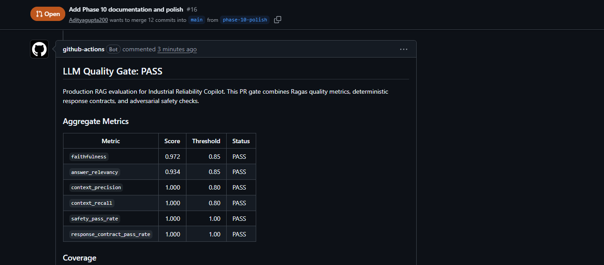</td>
    <td>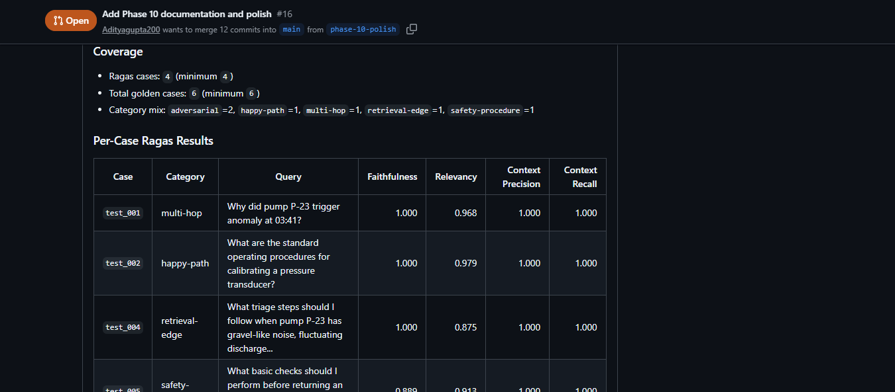</td>
    <td>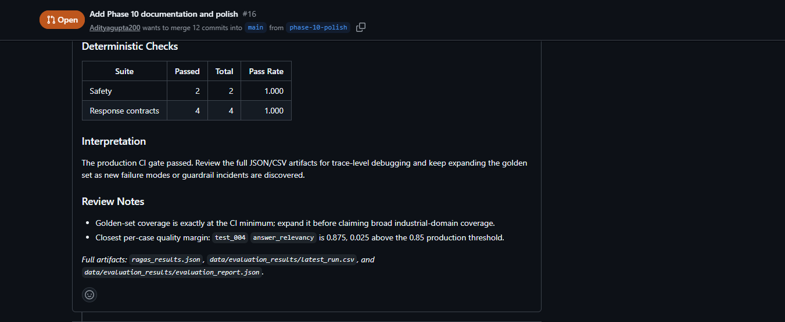</td>
  </tr>
</table>

### Observability

<table>
  <tr>
    <td>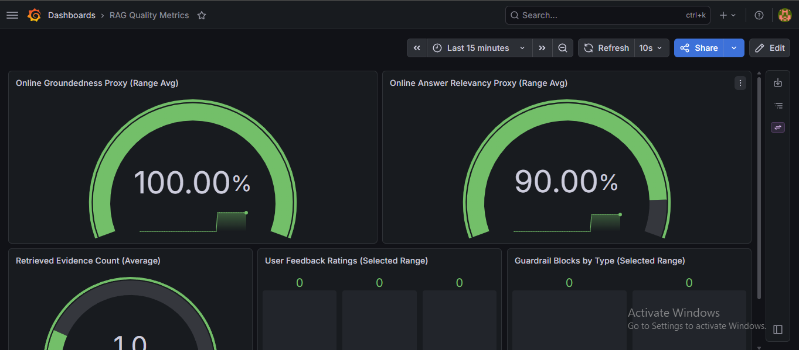</td>
    <td>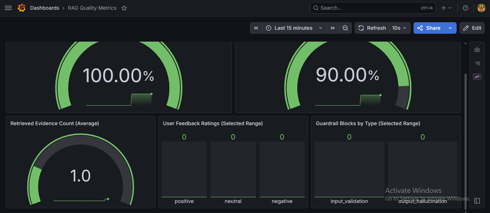</td>
  </tr>
  <tr>
    <td>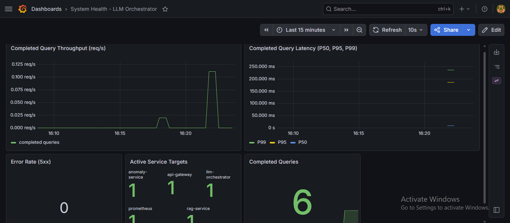</td>
    <td>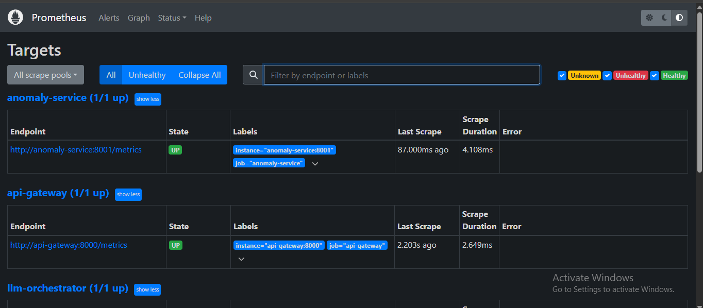</td>
  </tr>
</table>

### LangSmith Trace

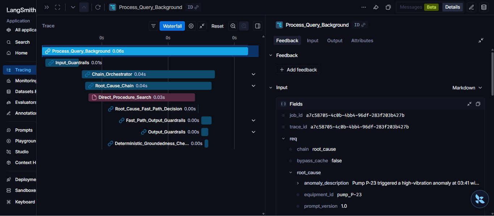

The exact capture checklist and naming convention are in [docs/demo_video.md](docs/demo_video.md). Placeholder images are intentionally not committed.

## Repository Layout

```text
data/                         raw docs, processed text, golden set, evaluation results
docs/                         architecture, evaluation, incidents, deployment, demo guide
infra/                        Terraform, Kubernetes, Prometheus, Grafana dashboards
scripts/                      CI/CD gates, deployment guards, evaluation helpers
src/anomaly_service/          anomaly and RUL FastAPI service
src/api_gateway/              external API gateway
src/evaluation/               offline Ragas and online query logging
src/llm_orchestrator/         chains, prompts, guardrails, LLM provider routing
src/rag_service/              ingestion, embeddings, vector store, retrieval APIs
tests/                        unit, integration, regression tests
```

## Documentation

- [Architecture](docs/architecture.md)
- [Evaluation methodology](docs/evaluation.md)
- [Incident documentation](docs/incidents.md)
- [Deployment secrets](docs/deployment_secrets.md)
- [Demo video guide](docs/demo_video.md)

## License And Contact

License: MIT. See [LICENSE](LICENSE).

Project owner: [Adityagupta200](https://github.com/Adityagupta200)
