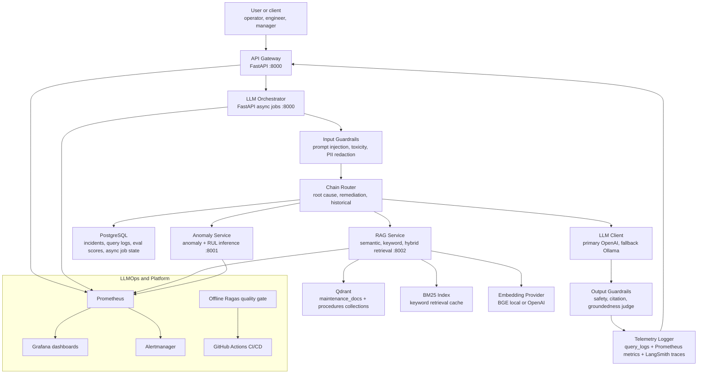
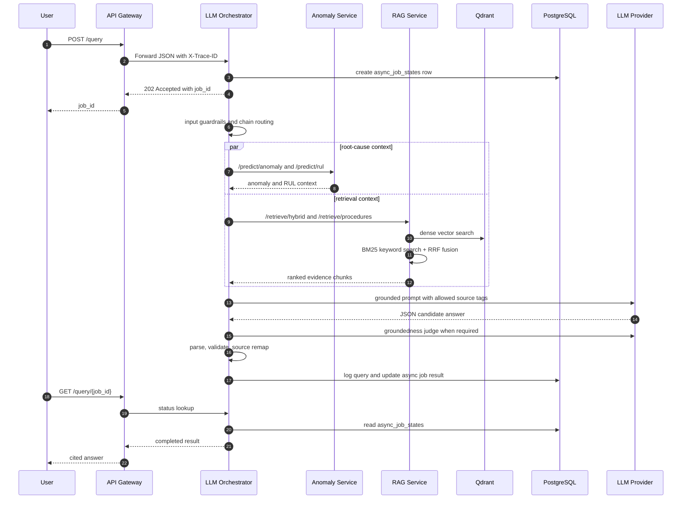
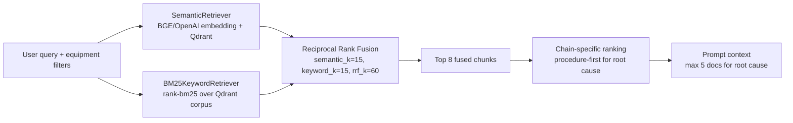
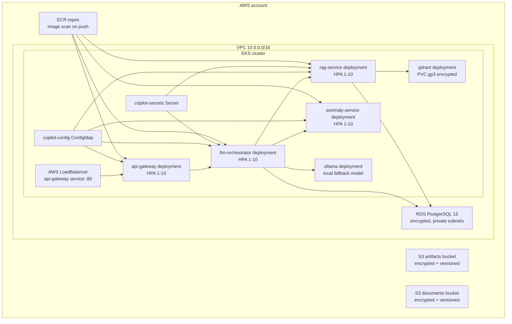

# Industrial Reliability Copilot Architecture

## System Overview

Industrial Reliability Copilot is a production-oriented RAG and MLOps platform for industrial maintenance triage. It helps maintenance engineers, operators, and reliability leads answer questions such as "Why did pump P-23 fail?", "What procedure should I follow?", and "Have we seen this failure pattern before?"

The system combines three evidence sources:

- Real-time or request-time equipment telemetry processed by the Anomaly Service.
- Maintenance manuals and procedures indexed in Qdrant for semantic and keyword retrieval.
- Structured incident history stored in PostgreSQL for historical analysis.

The design goal is not to let an LLM freely diagnose equipment. The LLM receives bounded context, must cite retrieved sources, is checked by guardrails, and is evaluated continuously with Ragas and contract tests.

Primary users:

- Operators: safe triage guidance and escalation cues.
- Maintenance engineers: root-cause hypotheses, supporting evidence, procedures, and historical context.
- Reliability managers: incident trends, quality metrics, latency, cost, and deployment health.
- ML/platform engineers: prompt quality gates, traces, rollouts, rollback criteria, and service metrics.

## System Architecture

## Component Descriptions

| Component | Purpose | Inputs | Outputs | Tech stack | Runtime notes |
| --- | --- | --- | --- | --- | --- |
| API Gateway | Single public entry point for `/query`, status polling, health, and metrics. It adds trace IDs and isolates clients from internal services. | JSON query payloads and `X-Trace-ID` headers. | `202` job responses, status payloads, Prometheus metrics. | FastAPI, httpx, Prometheus client. | Exposed locally on `127.0.0.1:8000`; Kubernetes exposes it through a LoadBalancer service on port 80. |
| LLM Orchestrator | Runs the diagnostic chains, applies guardrails, stores async job state, logs online evaluation data, and exposes feedback. | Root-cause, remediation, or historical search payloads. | Typed Pydantic responses with `chain`, `result`, `raw_context`, `latency_ms`, model info, and guardrails applied. | FastAPI, Pydantic, LangSmith tracing, SlowAPI rate limiting, SQLAlchemy async, LangChain providers. | Returns async job IDs and stores job state in PostgreSQL so multiple pods can serve status reads. |
| Anomaly Service | Provides anomaly score and RUL prediction context for root-cause analysis. | Sensor readings such as vibration, temperature, pressure, and flow. | `anomaly_score`, `confidence`, `predicted_rul`, schema ID, model version. | FastAPI, PyTorch, scikit-learn, joblib, MLflow hooks, Loguru. | Degrades safely with heuristic or baseline responses when model artifacts are unavailable. |
| RAG Service | Retrieves maintenance evidence from manuals and procedures. Structured incident history is read separately from PostgreSQL by the historical chain. | Query text, `k`, retrieval mode, and filters such as equipment ID, plant ID, severity, date, role. | Ranked document chunks with metadata, source, score, and latency. | FastAPI, Qdrant client, BGE/OpenAI embeddings, rank-bm25, Sentence Transformers reranker utility. | Semantic and keyword retrievers are initialized lazily to avoid startup failures on cold environments. |
| Ingestion Pipeline | Converts PDFs and Markdown procedures into chunked, embedded Qdrant points. | Files under `data/raw/manuals` and `data/raw/procedures`. | Processed text JSON, Qdrant vectors, ingestion manifest. | PyMuPDF, tiktoken, deterministic UUID chunk IDs, Qdrant upserts, manifest hashing. | Re-ingests only changed files unless `force=True` is used. |
| Offline Evaluation | Runs the golden set through the full stack and computes Ragas plus safety/contract checks. | `data/golden_test_set.json`, running services, OpenAI judge credentials. | `ragas_results.json`, `data/evaluation_results/summary.json`, CSV and report JSON. | Ragas 0.1.21, datasets, LangChain OpenAI, httpx. | CI blocks deployment when metrics or contract checks fall below thresholds. |
| Observability Stack | Tracks health, online quality proxies, feedback, actual LLM token estimates, fast-path share, completed-query latency, cache events, and errors. | `/metrics` endpoints and query logs. | Grafana dashboards and Alertmanager alerts. | Prometheus, Grafana, Alertmanager, LangSmith. | Dashboards are provisioned from `infra/monitoring/grafana-dashboards`. |

## Database And Index Design

### Qdrant Collections

The ingestion pipeline creates two collections through `QdrantStore.ensure_collection`:

| Collection | Contents | Vector distance | Main payload fields | Access pattern |
| --- | --- | --- | --- | --- |
| `maintenance_docs` | PDF manual chunks from `data/raw/manuals`. | Cosine. | `text`, `source_file`, `path`, `equipment_id`, `source_id`, `doc_type`, `chunk_index`. | Semantic retrieval, BM25 corpus rebuild, hybrid root-cause context. |
| `procedures` | Markdown procedure chunks from `data/raw/procedures`. | Cosine. | Same payload shape as manuals. | Remediation guidance and procedure-first root-cause support. |

Current code creates vector indexes and stores filterable payloads. It does not explicitly create Qdrant payload indexes yet. For larger collections, add payload indexes for `equipment_id`, `plant_id`, `allowed_roles`, `severity`, and `date` so metadata filters remain fast.

### PostgreSQL Tables

The RAG service owns the incident schema:

| Table | Purpose | Important columns | Indexes |
| --- | --- | --- | --- |
| `incidents` | Structured failure history for historical search. | `id`, `timestamp`, `equipment_id`, `sensor_data` JSONB, `failure_mode`, `severity`, `actions_taken`, `outcome`, `resolution_time_hours`. | `equipment_id`, `failure_mode`, `ix_incidents_equipment_timestamp`, `ix_incidents_failure_mode_timestamp`. |

The online evaluation logger owns telemetry tables:

| Table | Purpose | Important columns | Access pattern |
| --- | --- | --- | --- |
| `query_logs` | Query, answer, retrieved context, latency, and user feedback. | `query_id`, `user_query`, `answer`, `retrieved_contexts`, `latency_ms`, `user_feedback_score`. | Incident debugging, online quality sampling, feedback review. |
| `evaluation_scores` | Per-query online quality scores when available. | `query_id`, `faithfulness`, `answer_relevancy`. | Trend monitoring and alert investigation. |
| `async_job_states` | Distributed async status store for orchestrator jobs. | `job_id`, `status`, `result`, `error`, timestamps. | `GET /query/{job_id}` across horizontally scaled pods. |

## LLM Layer

| Area | Implemented strategy |
| --- | --- |
| Primary model | OpenAI via `LLM_PRIMARY_PROVIDER=openai`; default live-serving model `gpt-4.1-mini` for lower latency structured RAG responses. |
| Fallback model | Ollama via `LLM_FALLBACK_PROVIDER=ollama`; local model `llama3.1` or Kubernetes config `llama3.1:8b`. |
| Judge model | Online guardrail and Ragas CI default to `gpt-4.1-mini` for compatibility with the pinned evaluation stack. A stronger offline judge such as `gpt-5.4-mini` can be tested manually after confirming the client library does not send unsupported parameters. |
| Temperature | `0.0` for deterministic diagnostics. |
| Prompt versioning | Prompt templates live under `src/llm_orchestrator/prompts/<chain>/v1.0.txt` with metadata files. Requests carry `prompt_version`. |
| Prompt strategy | Context is tagged as `DOC_1`, `DOC_2`, etc. The model must cite only allowed tags. Chain code bounds the root-cause context budget, then maps validated tags back to human-readable filenames after validation. |
| Fallback logic | Transient primary provider errors are retried with exponential backoff. If the primary fails and fallback is distinct, the request is retried on fallback. Fatal config errors are not retried. |
| Output checks | Root cause outputs run safety, citation, and groundedness validation before parsing and source remapping. Groundedness uses deterministic citation/support checks first and falls back to an LLM judge when support is inconclusive. Remediation outputs are parsed into a strict schema and source tags are sanitized. |
| Deterministic fast path | For high-vibration pump cases, the root-cause chain first calls `/retrieve/procedures/direct`, a lexical lookup over real Markdown procedures. If the retrieved procedure explicitly supports bearing wear, insufficient lubrication, or misalignment, it returns a transparent `rules+retrieval` response without embedding inference or an LLM call. Ambiguous cases continue to semantic retrieval and the LLM path. |

## Query Data Flow

## Retrieval Flow

RRF is used because dense search catches paraphrases while BM25 catches exact terms such as asset IDs, failure modes, and procedure names. The fusion step is deterministic, cheap, and resilient when one retrieval path is degraded.

## Deployment Architecture

Terraform provisions the VPC, EKS 1.31 cluster, EBS CSI driver, encrypted RDS PostgreSQL, encrypted/versioned S3 buckets, and ECR repositories. GitHub Actions builds images, deploys to staging, runs smoke checks, then deploys to production with rollout monitoring and rollback on failure.

## Technology Choices

| Choice | Rationale | Trade-off |
| --- | --- | --- |
| FastAPI microservices | Simple async APIs, generated schemas, easy Kubernetes probes, and clear service ownership. | More inter-service calls than a monolith. Mitigated with connection pooling and internal services. |
| Qdrant | Self-hostable, fast vector retrieval, simple local Docker and EKS deployment, payload filtering, and persistent storage support. | Requires operational ownership. Managed vector databases reduce ops work but increase cost. |
| BGE local embeddings by default | Keeps local development and CI cheaper and avoids API dependency for indexing. | Model download and CPU inference increase startup time and memory. OpenAI embeddings are available for production CI. |
| Hybrid retrieval + RRF | Improves recall across exact asset IDs and semantic troubleshooting language. RRF is deterministic and low-latency. | Extra keyword corpus maintenance and fusion tuning. |
| Prompt-tag source mapping | Prevents the model from inventing filenames and lets the chain verify citations before returning answers. | Requires careful context formatting and post-processing. |
| Async job state | LLM calls can exceed normal HTTP request latency. Job IDs make polling reliable and Kubernetes-friendly. | Client flow is two-step instead of synchronous. |
| Ragas + contract checks | Ragas measures answer/context quality, while deterministic checks catch safety and schema regressions. | LLM-as-judge evaluation has cost and variance, so CI pins dependencies and checks for null metrics. |
| Prometheus/Grafana | Standard operational stack for latency, errors, quality proxies, feedback, and cache events. | Requires dashboard and alert ownership. |

## Trade-offs

- Latency vs quality: The system retrieves both semantic and keyword candidates, runs procedure-first ranking, and may call a judge LLM. This improves groundedness but increases tail latency. The current hybrid defaults cap candidates (`semantic_k=15`, `keyword_k=15`, `out_k=8`) to keep CPU and context size controlled.
- Cost vs accuracy: OpenAI is used for primary production answers and judges when configured, while Ollama provides local fallback. Local fallback reduces outage risk and cost but may produce lower-quality JSON under complex prompts.
- Strictness vs answer coverage: Root-cause analysis aborts when no relevant documentation is retrieved. This can frustrate users, but it prevents unsupported safety-critical guidance.
- Freshness vs availability: Retrieval marks old documents as outdated instead of silently excluding them. Operators still see useful evidence, but the response carries a freshness signal.
- Developer speed vs security: Local Docker Compose uses simple defaults and open CORS for development. Production must terminate auth at the gateway or ingress, restrict CORS, and use Kubernetes secrets plus cloud IAM.

## Scalability And Bottlenecks

| Layer | Scaling strategy | Bottlenecks | Mitigations |
| --- | --- | --- | --- |
| API Gateway | HorizontalPodAutoscaler to 10 replicas. | Downstream orchestrator latency. | Connection pooling, async forwarding, trace IDs. |
| LLM Orchestrator | HPA to 10 replicas, database-backed job state. | LLM provider latency, judge calls, database connection pool. | Async jobs, cache for repeated queries, provider fallback, rate limiting. |
| RAG Service | HPA to 10 replicas. | Embedding model CPU/memory, Qdrant latency, BM25 rebuild. | Lazy initialization, query embedding cache, bounded candidate pools, persistent Qdrant. |
| Qdrant | Persistent PVC in current EKS manifest. | Single-pod vector DB is the main scaling limit. | For larger production load, move to Qdrant cluster or managed Qdrant with replicas and payload indexes. |
| PostgreSQL | RDS private subnets, indexed incident table. | Query log growth, text-to-SQL pressure on incident history. | Retention policies, partitioning by time, read replicas for analytics. |
| LLM Provider | External API primary, local Ollama fallback. | Rate limits, context size, provider outages. | Token budgets, fallback, request timeout, monitoring, cache hits. |

The codebase has HPA manifests and rollout guards, but a committed 50 QPS load-test artifact is not present. Treat 50 QPS as a production target until a reproducible load report is added.

## Security

Implemented controls:

- Secrets are injected from `.env` locally and `copilot-secrets` in Kubernetes.
- GitHub Actions deploys to AWS through OIDC instead of long-lived AWS keys.
- CD preflight validates required secrets and rejects local or in-cluster database hostnames for EKS/RDS deployments.
- RDS storage encryption, S3 server-side encryption, S3 public access blocks, S3 versioning, and encrypted gp3 EBS storage are configured.
- Input guardrails detect prompt injection, toxicity keywords, and redact PII through Presidio when models are loaded.
- Output guardrails check unsafe maintenance instructions and groundedness.
- Historical search SQL is parsed by sqlglot and restricted to read-only `SELECT` statements over allowed tables.
- Orchestrator rate limits `/query` and `/feedback`.
- Query logs, trace IDs, and LangSmith traces support auditability and incident review.

Important production gap:

- End-user authentication and role-based authorization are documented as a gateway responsibility, but the current API Gateway does not yet enforce JWT/OIDC authentication. Before external production exposure, add auth middleware, restrict CORS origins, propagate user identity to retrieval filters, and enforce `allowed_roles`/tenant metadata in Qdrant.

## Operational Readiness

Health endpoints:

- `/health/live` on API Gateway, Orchestrator, RAG Service, and Anomaly Service.
- `/health/ready` on all services for Kubernetes readiness.
- `/metrics` on all services for Prometheus.

Critical alerts:

- `HighLatency`: orchestrator p95 latency above 3 seconds for 5 minutes.
- `LowFaithfulness`: average faithfulness below 0.75 for 15 minutes.
- `HighErrorRate`: 5xx rate above 5 percent for 5 minutes.

Release gates:

- Unit and integration tests.
- Black and Ruff.
- Bandit security scan.
- Offline Ragas evaluation.
- Threshold checks for faithfulness, answer relevancy, context precision, context recall, safety, and response contracts.
- Staging rollout and smoke tests before production rollout.
